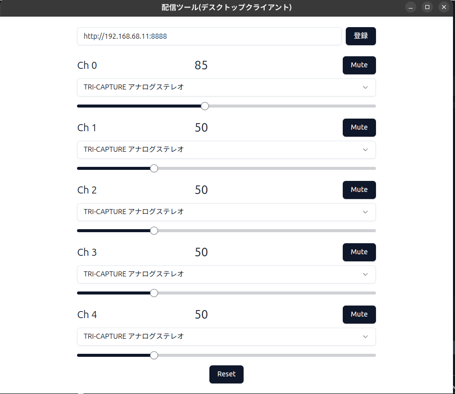
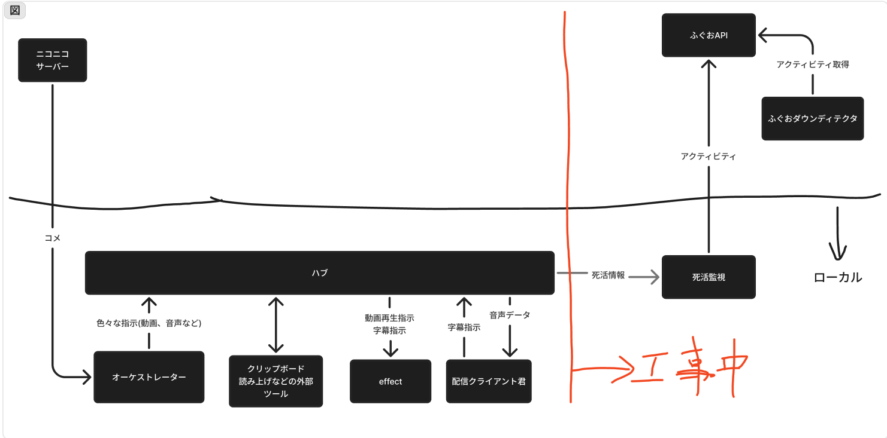

# livestream_kit
## なにこれ
このリポジトリは、[ふぐお](https://www.nicovideo.jp/user/98746932/live_programs)が配信中に使用している配信ツールです。

## 動画コマンドを追加したい方へ
`video`ディレクトリに使用したい動画のファイルを追加してください。
その動画のファイル名=コマンド名になります。  
その後、プルリクエストを送ってください。短めの動画だったら、多分マージします。  

## 使い方

### 1. VoicePeakのセットアップ
CLIで実行可能なVoicePeakのバイナリが入ったディレクトリを`./voicepeak/mountspace/Voicepeak/`に配置します。  
CLIが実行できるvoicepeakの実行ファイルが`./voicepeak/mountspace/Voicepeak/voicepeak`になるようにしてください。  

### 2. オーケストレーターのセットアップ
まず、以下のようにspotifyのAPIを使用するためのクレデンシャルを.envファイルに書き込んでください。  

```.env
SPOTIFY_CLIENT_ID=hogeID
SPOTIFY_CLIENT_SECRET=hogeSecret
SPOTIFY_REFRESH_TOKEN=hogeToken
```

.envはこのリポジトリのルートディレクトリに配置してください。  

次に、以下のコマンドでオーケストレーターを起動します。

```bash
docker compose -f docker-compose.orchestrator.yml up orchestrator
```

### 3. デスクトップ配信クライアントのセットアップ

以下のコマンドでアプリケーションをビルドします。  
```bash
# 依存関係のインストール
pnpm i

# windows向けにビルド
pnpm client build:win

# Linux向けにビルド
pnpm client build:win
```

desktop_client/dist/以下にビルドされた実行ファイルが配置されます。  
ビルドされたアプリを開きます。  



上の画像のようなウィンドウが表示されます。  
URL欄にオーケストレーターのサーバーが立っている場所のアドレスを入力します。  

音声読み上げはCh0, エラーや接続情報はCh4に出力されます。  

### 4. エフェクトページのセットアップ
以下のコマンドでhtmlファイルをビルドします。  

```bash
# 依存関係のインストール
pnpm i

pnpm effect build
```

ビルドされたhtmlファイルを配信ソフトのブラウザソース等で読み込みます。  

## システム図

  

[細かい技術的詳細はここから](https://qiita.com/boxfish_jp/items/703f8dc2d4674bf6802b)

もし、なにか疑問等あれば、Issueやニコ生のコメント、TwitterのDM等でお知らせください。  
